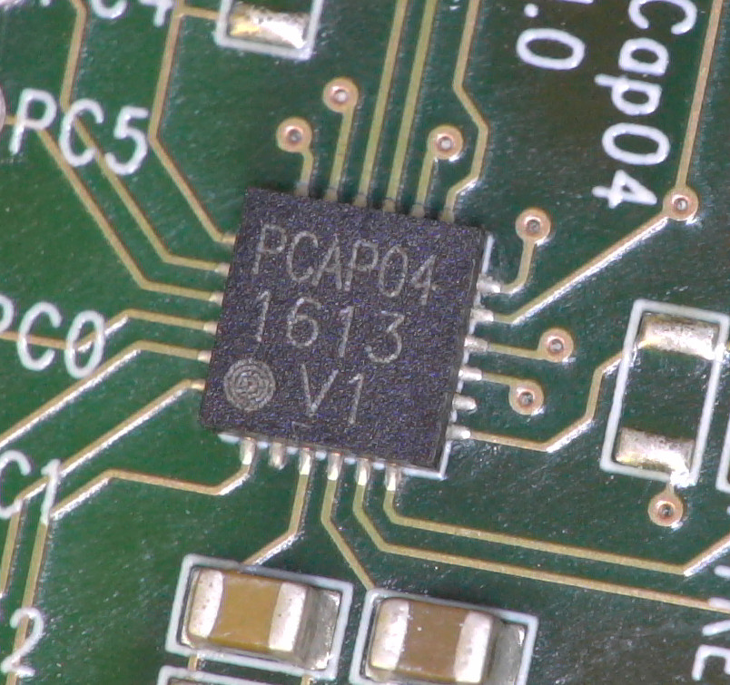

# ScioSense PCap04 STM32L476RG Library
STM32L476RG library for the PCap04 Capacitance to Digital Converter.

PCap04 is a capacitance-to-digital converter (CDC) with integrated digital signal processor (DSP)
for on-chip data post-processing. Its front end is based on the PICOCAP principle.
The PCap04 converter produced by [ScioSense](http://www.sciosense.com).
It comes in the smallest size QFN24 package with digital I2C and SPI interfaces.
This enables new use cases in Position sensors, Pressure sensors , Force sensors,
Proximity sensors, Acceleration sensors, Inclination sensors, Humidity sensors,
Dewpoint sensors, Tilt sensors, Angle sensors, Wireless applications.

## Links
* [Datasheet](https://www.sciosense.com/wp-content/uploads/documents/PCAP04-Datasheet.pdf)
* [Application notes](https://www.sciosense.com/products/sensor-interfaces/pcap04-capacitance-to-digital-converter/#documents)
* Buy the PCap04 on [Mouser](https://www2.mouser.com/c/?series=PCAP04%20VERSION%202) or [Digikey](https://www.digikey.com/en/products/filter/data-acquisition/adcs-dacs-special-purpose/768?s=N4IgTCBcDaIA4GMCGcAMAWAtAIwI4gF0BfIA)
* Buy the PCap04 evaluation kit on [Mouser](https://www2.mouser.com/ProductDetail/ScioSense/PCap04-EVA-KIT-V2.0?qs=YCa%2FAAYMW01pCMwt%2Fq6O1Q%3D%3D)
* [Further information about the PCap04](https://www.sciosense.com/products/sensor-interfaces/pcap04-capacitance-to-digital-converter/)  

 
## Prerequisites
It is assumed that
 - The STM32CubeIDE has been installed.
   If not, refer to "Install the STM32CubeIDE" on the
   [ST site](https://www.st.com/en/development-tools/stm32cubeide.html#overview).
 - The STM32CubeMX has been installed.
   If not, refer to "Install the STM32CubeMX" on the
   [ST site](https://www.st.com/en/development-tools/stm32cubemx.html).
 - The STM32CubeProgrammer could been installed, optionally.
   If not, refer to "Install the STM32CubeProgrammer" on the
   [ST site](https://www.st.com/en/development-tools/stm32cubeprog.html).
 - The STM32CubeMonitor could been installed, optionally.
   If not, refer to "Install the STM32CubeMonitor" on the
   [ST site](https://www.st.com/en/development-tools/stm32cubemonitor.html).
   
- The STM32CubeL4GettingStarted document is at its default location. Normally this is `C:\Users\[your_username]\STM32Cube\Repository\STM32Cube_FW_L4_xx.yy.z\Documentation`.

You might need to add your board to the STM32CubeIDE. This library was tested with the [STM32 Nucleo-64 development board with STM32L476RG MCU](https://www.st.com/en/evaluation-tools/nucleo-l476rg.html#overview)
(https://www.st.com/en/microcontrollers-microprocessors/stm32l476rg.html). 
For the installation of the STM32L476RG in the STM32CubeIDE, see [STM32L476RG Installation](https://www.st.com/en/development-tools/stm32cubemx.html#documentation)

## Installation

### Manual installation
- Download the code from this repository via "Download ZIP".
- In STM32CubeIDE, select Import > General > Existing Projects into Workspace... and browse to the just unpacked ZIP file.
- if needed, include Source Library, select Oüen Properties > C/C++ General > Code Analysis > Paths and Symbols
  Includes > Add include directories > ../../_Src_Lib
  Move this directory up to the second place.
- When the IDE is ready this README.md should be located in your workspace.

## Wiring

### General
Please make sure that you use the correct supply voltage:
- The PCap04 runs at VDD = 2.1V(3.0V) to 3.6V. If you are using the Sciosense PCap04 breakout board, you can use VDD = 3.3 V thanks
to the onboard LDO. 
- The I2C communication is 3.3 V tolerant.

### Example with STM32L476RG (I2C)
This example shows how to wire a [NUCLEO-L476RG](https://www.st.com/en/evaluation-tools/nucleo-l476rg.html#documentation) 
with the PCap04 breakout board for I2C communication.

| PCap04 breakout board | STM32L476RG |
|:---------------------:|:-----------:|
|          VDD          |     3V3     |
|          GND          |     GND     |
|          IIC_EN       |     3V3     |
|          I2C1_SDA     |     PB7     |
|          I2C1_SCL     |     PB8     |
|          INTN         |     PA9     |

### Example with STM32L476RG (SPI)
This example shows how to wire a [NUCLEO-L476RG](https://www.st.com/en/evaluation-tools/nucleo-l476rg.html#documentation) 
with the PCap04 breakout board for SPI communication.

| PCap04 breakout board | STM32L476RG |
|:---------------------:|:-----------:|
|          VDD          |     3V3     |
|          GND          |     GND     |
|          IIC_EN       |     GND     |
|          SPI1_SCK     |     PA5     |
|          SPI1_MISO    |     PA6     |
|          SPI1_MOSI    |     PA7     |
|          SPI1_SSN     |     PB6     |
|          INTN         |     PA9     |

### Interrupt functionality
To use the PCap04's interrupt functionality connect the interrupt pin of the PCap04 to a GPIO pin of your STM32L476RG. The 
interrupt pin uses VDD.

## Build an example
To build a sample code
 - Clean Project
 - Index > Rebuild
 - Depending on the microcontroller, the pin assignment must be verified again.
 - Build Project

## Contributing
Contributions in the form of issue opening or creating pull requests are very welcome!

## Acknowledgements
This library is developed for ScioSense by [at² GmbH](https://www.at2-software.com/en/) 

@at2software

### ScioSense is a Joint Venture of ams AG 
